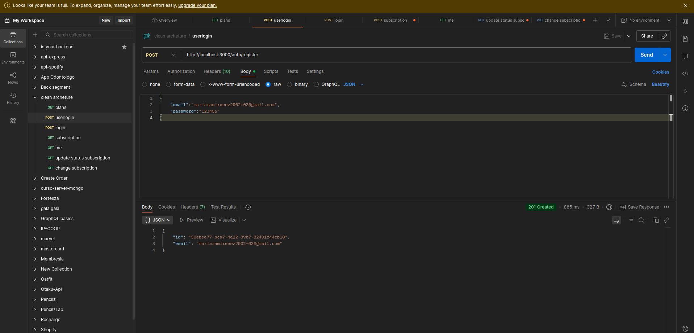
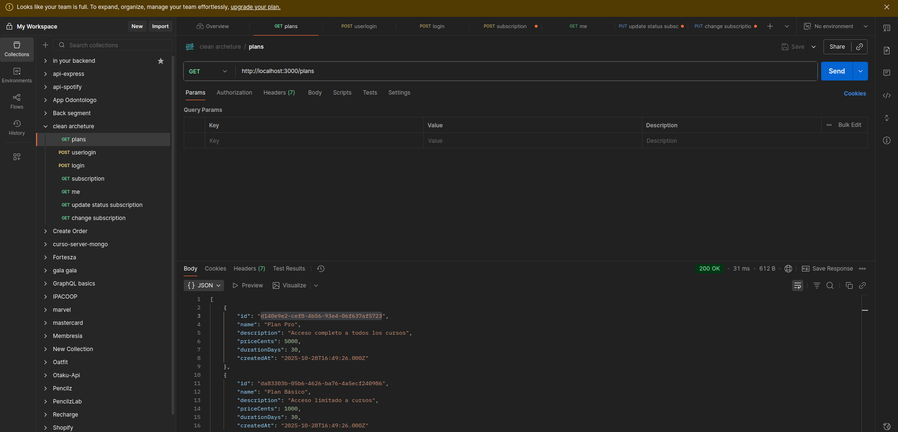

## ENDPOINTS creados

#### explicacion de arquitectura usada
* domain: se agregaron las entidades plan subscription user
* applications: se implementaron los ports que son las interfacez de los metodos que usaran los casos de uso.
* infrastructure: seccion donde se implementan los repositorios configuracion del firebase y db con sus migraciones

### Como funciona
* el controlador llama a los casos de uso
* los casos de uso llaman a las interfacez, las implementaciones se definen en el app.module.ts,alli se aloja la logica de negocio
* los repositorios solo contienen acciones sql insert,select, update,delete

### implementacion con firebase
* se creo una colleccion audit_logs donde se guardan los eventos

## Endpoints
### /auth/registe

### /auth/login

### /plans

### /subscription

### /me subscription

### /subscription/status

### /subscription/change

